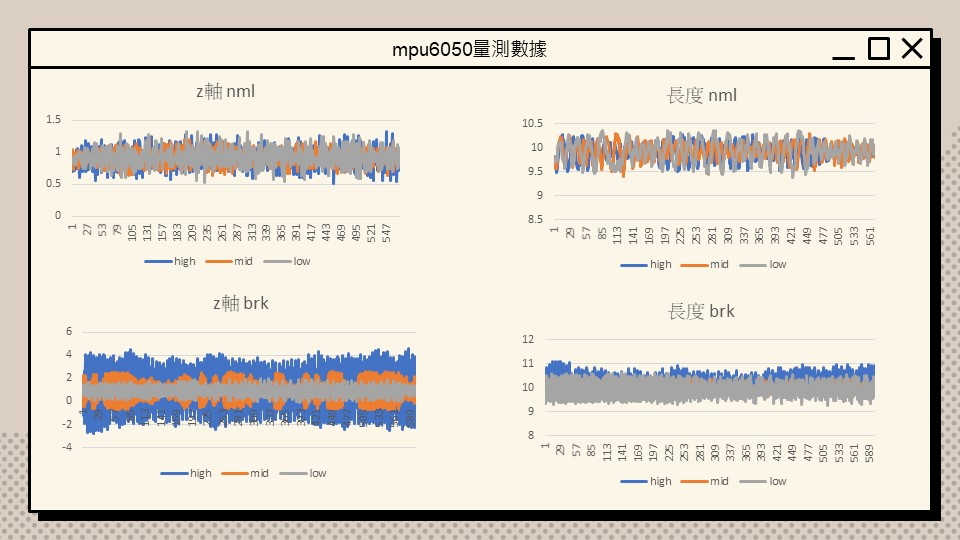
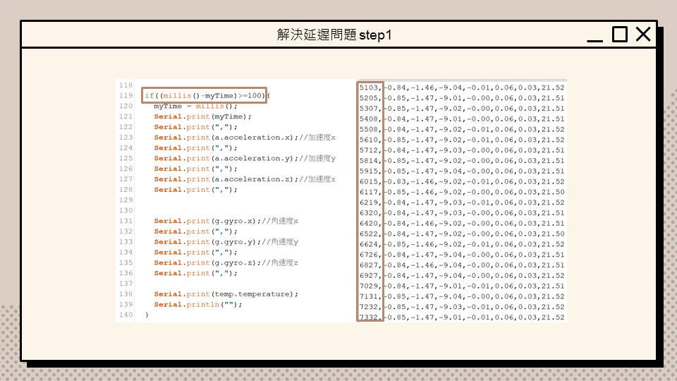
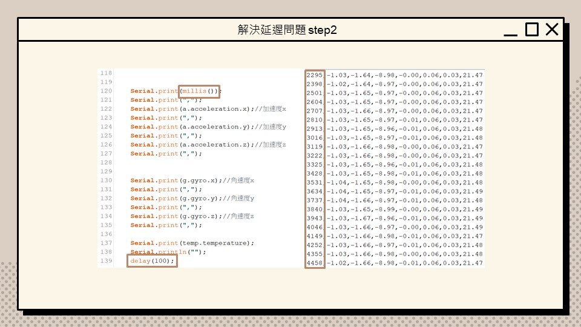
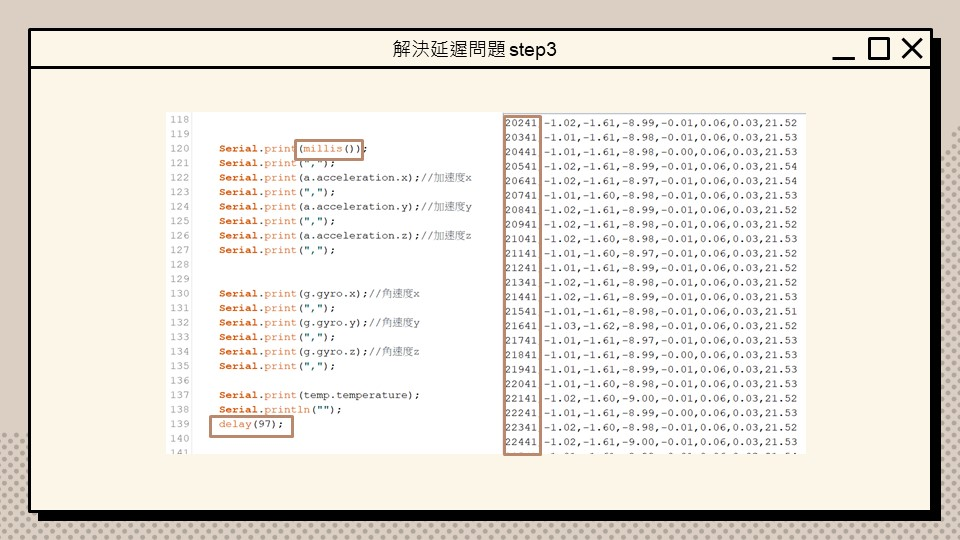
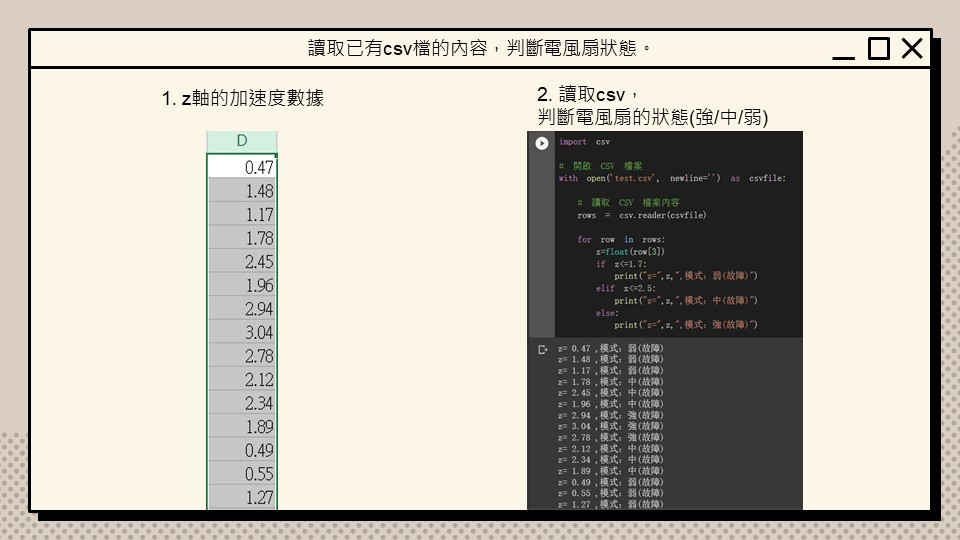
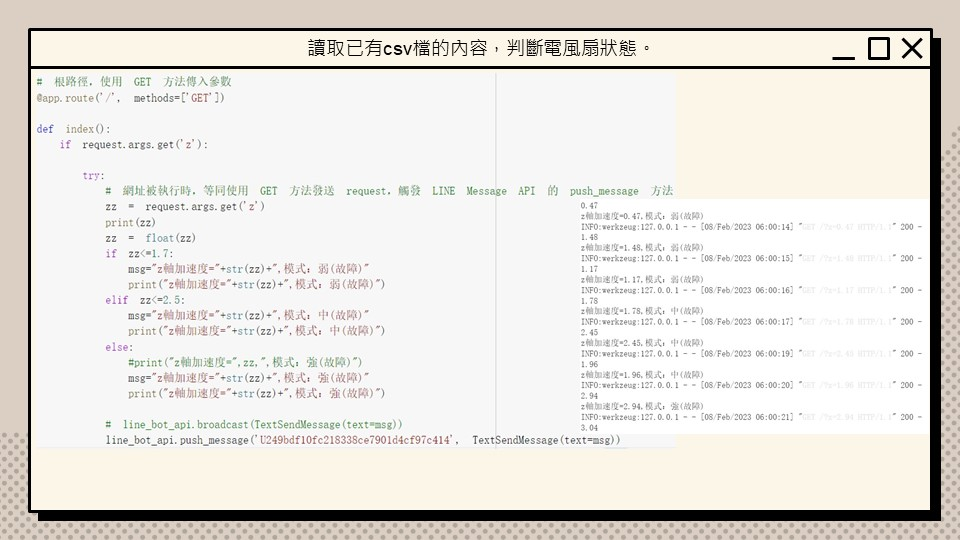
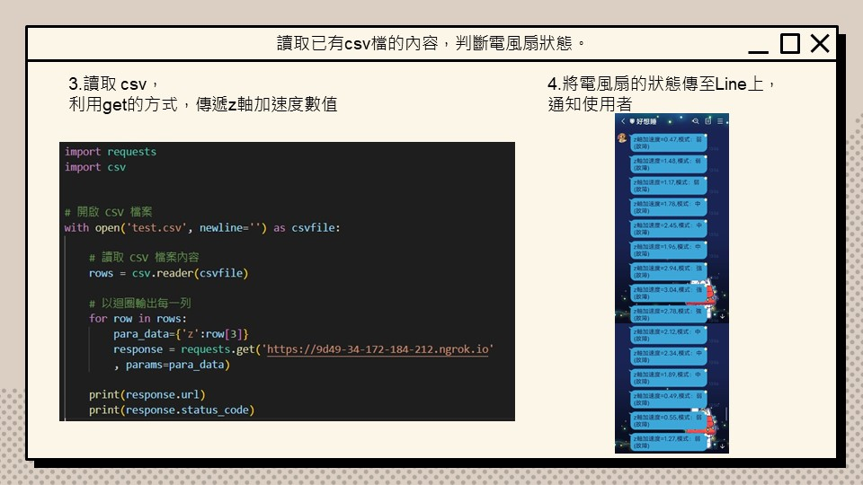

# 風機異常檢測系統 Fan Anomaly Detection System   
### #Arduino #MPU6050 #Matlab #Line BOT #OpenAI API

### 一. 簡介
藉由觀察風機震動數據來了解風機葉片損壞的情形，並透過機器學習建置故障偵測系統

### 二. 流程
- 感測器製作
    - mpu6050量測數據
    

         
         
    
 

    - 解決延遲問題
    

         
         
         
    
 

- 機器學習
    - 用matlab訓練&判斷模型
    

         
    
 
- LINE BOT
    - 實做回覆表情貼圖功能
    當使用者傳送了表情貼圖，LINE BOT 就會回覆一模一樣的表情貼圖 ( 限制為官方預設的表情貼圖 )。
    

         
    
 

    - 結合電風扇數據，判斷電風扇狀態
        1. z軸的加速度數據(csv)
        2. 匯入csv，判斷電風扇的狀態(強/中/弱/正常/故障)(python)
        3. 讀取 csv，利用get的方式，傳遞z軸加速度數值
        4. 將電風扇的狀態傳至Line上，通知使用者

    

         
    

    

         
    
  
    

         
    
  

